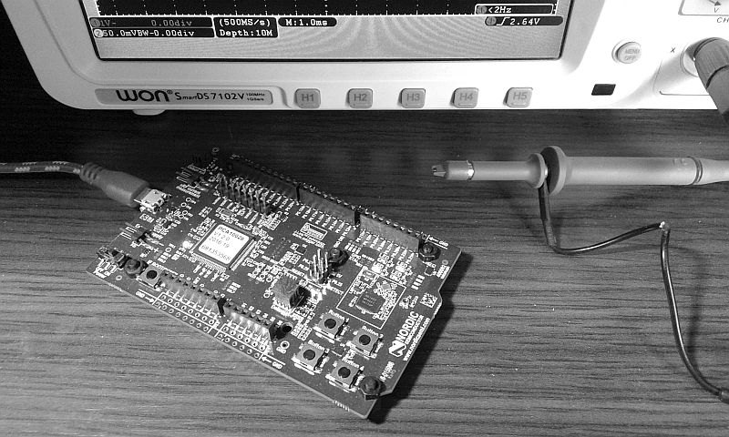
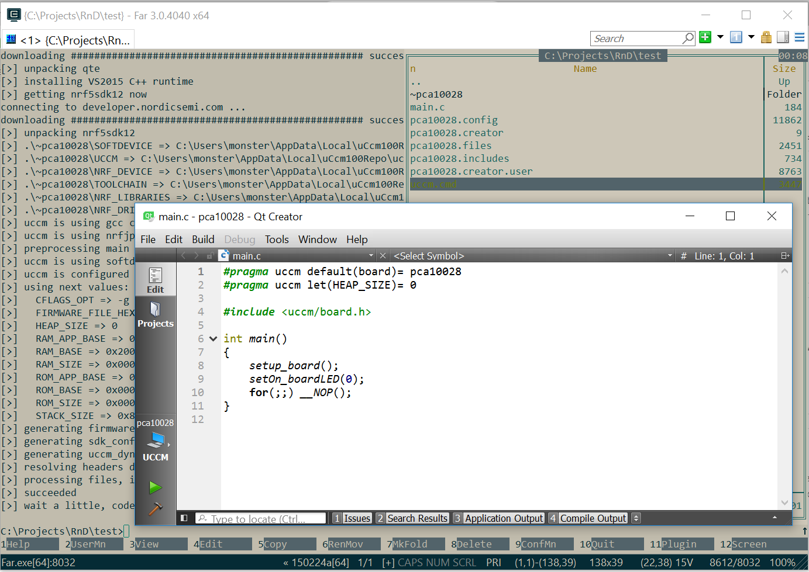
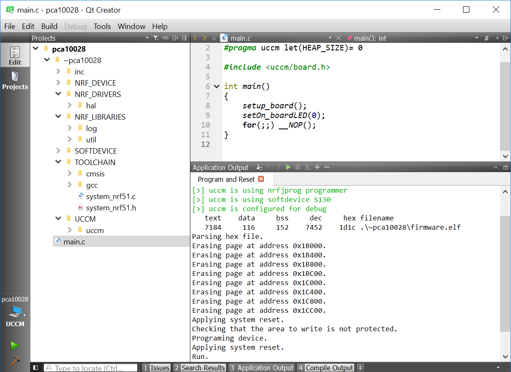

# Overview
The uccm is an **uC Cortex-M zero-config build tool and modules manager**. It means this building tool does not require additional configuration files. All required information needed to build firmware exists in sources. Also the tool automatically gets modules from guithub detecting required modules by _#include_ C-preprocessor derectives.

# Quick Start with PCA10028 (nRF51)

Let's start with simple example turning on one LED. Firstly we need a main.c file like a following:
```c 
#pragma uccm default(board) = pca10028
#pragma uccm let(HEAP_SIZE) = 0
#include <uccm/board.h> // borad depended defininitions

int main()
{
    setup_board();
    setOn_boardLED(0);
    for(;;) __NOP();
}
```

Secondary, we need the uccm start script which is available on GitHub https://github.com/sudachen/uccm/blob/master/uccm100-dist.zip. Now when we have in one directory main.c and uccm.cmd go to the directory and start next command 
```
uccm -y --edit
```

It downloads all required SDK files, gcc compiler and code editor. At final it creates project and opens main.c in code editor.



Since this quick start uses pca10028 board based on nRF51823 BLE powered uC, by default uccm configures firmware as used softdevice. Softdevice is the special firmaware operating with radio channel and allowing to user code communicate va Bluetooth Low Energy. It requirese write this firmware once to the board. Fo this do the next command
```
uccm --program-softdevice
```

It erases all chip flash memory and writes softdevice to the begin. Normally it is required to do only once. For this operation devboard chould be coonected to the PC and powered on.

Ok, now all is ready to start simplified example turning on one LED. For compale and flash compiled firmare press start button. It is green trinagle at the bottom of the left panel in the editor. 



Devboard should resets and lights LED1.


